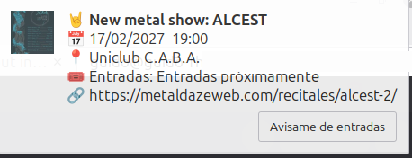

# Metal-Daze agenda watcher

Desktop notifications for new metal gigs in Argentina, and for the moment their tickets finally go on sale.

The script fetches the gig listing at [metaldazeweb.com/agenda](https://metaldazeweb.com/agenda/) once an hour, compares it against the previous run, and notifies you about anything that changed. Shows you mark as interesting get watched until their tickets appear.

It is a single Python file with no dependencies beyond the standard library, plus `notify-send`, which any Linux desktop already has.



## What it notifies you about

**Every new show on the agenda.** One notification per show, with the flyer, date, venue, price, ticket status and links. It stays on screen until you click it.

**Tickets going on sale, but only for shows you asked about.** Shows are often listed weeks before their tickets exist, which is the problem this solves. Press "Avisame de entradas" on the notification and you get told the moment a ticket link appears. This is opt-in per show, so you are not notified about tickets for the hundred shows you do not care about.

**Date, time or venue changes, again only for shows you asked about.**

## Install

Requires Python 3.8 or newer, `notify-send` (package `libnotify-bin` on Debian and Ubuntu) and a running notification daemon.

```bash
git clone <your-fork-url> MetalNotifications
cd MetalNotifications
python3 monitor.py          # first run seeds the baseline, notifies nothing
```

The first run is deliberately silent. It records the agenda as it stands, so you do not get a hundred notifications for shows that were already listed. Only shows added afterwards notify you.

Then run it on a schedule with `crontab -e`:

```
17 * * * * cd /path/to/MetalNotifications && /usr/bin/python3 /path/to/MetalNotifications/monitor.py >> /path/to/MetalNotifications/cron.log 2>&1
```

Use absolute paths. Cron does not run from your project directory and does not share your shell environment.

## Usage

Marking a show as interesting takes one click on the "Avisame de entradas" button of its notification. Everything below is the same thing from the terminal.

```bash
python3 monitor.py watch alcest      # search the agenda, pick what to watch
python3 monitor.py list              # what you are waiting on
python3 monitor.py unwatch alcest    # stop watching
python3 monitor.py                   # check the site now
```

`watch` and `unwatch` search band, venue and city together, ignoring case and accents, and print each match with its ticket status. When several shows match they ask which you meant. Add `--pick 1`, `--pick 1,3` or `--pick all` to answer up front, which is also how you drive it from a script.

Watching a show whose tickets are already on sale prints the ticket link instead of adding it to the watchlist.

A ticket alert fires once and the show then leaves the watchlist, since there is nothing left to wait for.

<details>
<summary><b>How it works</b></summary>

Each show is identified by band, date, time, venue and city. Anything whose identity was absent last run is new.

That identity contains the date and the venue, so a correction on the site would otherwise read as one show vanishing and a different one appearing. Shows are paired by their permalink first, and only reported as new when no pairing exists. Pairing is skipped when a permalink is ambiguous, which happens when one band plays two dates under a single page.

Ticket availability is read straight from the page rather than guessed. A show either has a ticket link or a status label in its place, one of "Entradas próximamente", "Sold out", "Ver flyer", "Gratis" or "Comunicate con la banda". A watched show gaining a link is the event you get told about.

Flyers cost no extra requests. The listing already embeds a 150x150 thumbnail per show, which is downloaded once and cached in `images/`.

Buttons need a helper process. `notify-send --action` blocks until the notification is closed, and the hourly run has to exit, so the script re-executes itself detached as `_await_click` with a payload describing what the button should do. On a click `notify-send` prints the action name, on a dismiss it prints only the notification id, which is how the two are told apart. Helpers exit on their own when the notification closes, are killed after 14 days if a notification is never touched, and are capped at 20 at once. Past that cap, notifications are still sent, just without a button.

</details>

<details>
<summary><b>Files</b></summary>

| File | What it is |
|---|---|
| `monitor.py` | The whole program |
| `known_shows.json` | Every show seen on the last run. Deleting it makes the next run treat the whole agenda as already seen, which silently swallows genuinely new shows |
| `watchlist.json` | Shows waiting for tickets |
| `images/` | Cached flyers |
| `.pending/` | Payloads for notifications still on screen |
| `monitor.log`, `cron.log` | Run history |

Only `monitor.py` and the docs are tracked in git. Everything else is local state.

</details>

<details>
<summary><b>Limits and assumptions</b></summary>

The parser reads the HTML of a specific WordPress theatre plugin with regular expressions. A redesign of the site will break it. When zero shows parse, the script logs a warning and leaves the state file untouched rather than treating the whole agenda as cancelled.

Only shows on the agenda page are seen. There is no notification when a show disappears from the listing, which is what a cancellation looks like. A watched show that vanishes is dropped quietly after 30 days.

Tested on XFCE with `xfce4-notifyd`. Other daemons render notifications differently, and a few ignore action buttons entirely, in which case the terminal commands still work.

Notifications are in a mix of English and Spanish, matching the site.

</details>
